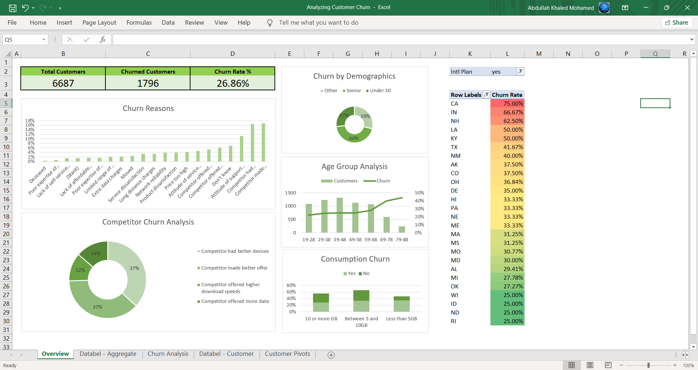

# 📊 Customer Churn Analysis

## Objective
The primary goal of this project was to analyze customer behavior and identify key drivers of churn. By understanding patterns in the data, actionable insights were derived to improve customer retention strategies.

---

## Methodology

### Data Preprocessing
1. **Dataset Overview**:
   - **Total Customers**: 6,687
   - **Churned Customers**: 1,796
   - **Churn Rate**: 26.86%

2. **Cleaning and Feature Engineering**:
   - Grouped customers by categories such as age demographics (e.g., "Under 30," "Senior") and Grouped Consumption (e.g., "Less than 5GB," "Between 5 and 10GB").
   - Created Age Groups (e.g., "29-38," "39-48").
   - Calculated churned status (binary) and associated churn reasons.

3. **Segmentation**:
   - Created grouped aggregations for detailed insights (e.g., churn rate by demographic).

---

## Insights

### Key Findings
1. **Demographics and Churn**:
   - **Senior Customers** exhibited the highest churn rate at 38.22%.
   - **Under 30 Customers** showed a relatively lower churn rate of 23.00%.

2. **Service Features**:
   - Customers without **International Plans** were less likely to churn.

3. **Contract Types**:
   - Month-to-Month contracts had the highest churn rate compared to One-Year contracts.

### Recommendations
1. Develop targeted retention strategies for high-risk groups such as senior customers.
2. Offer incentives for customers on month-to-month plans to switch to long-term contracts.
3. Revise pricing models for international plans to better cater to heavy users.

---

## Conclusion
By leveraging comprehensive data preprocessing and analysis, this project delivered valuable insights into the primary drivers of customer churn. These findings empower businesses to implement targeted actions that improve customer satisfaction and retention.
